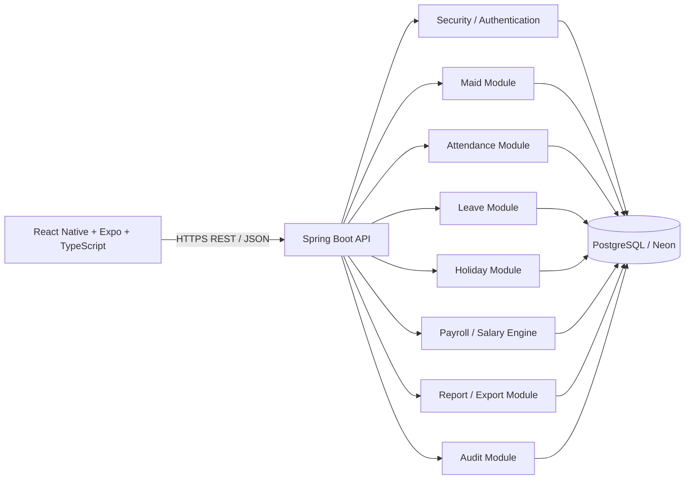
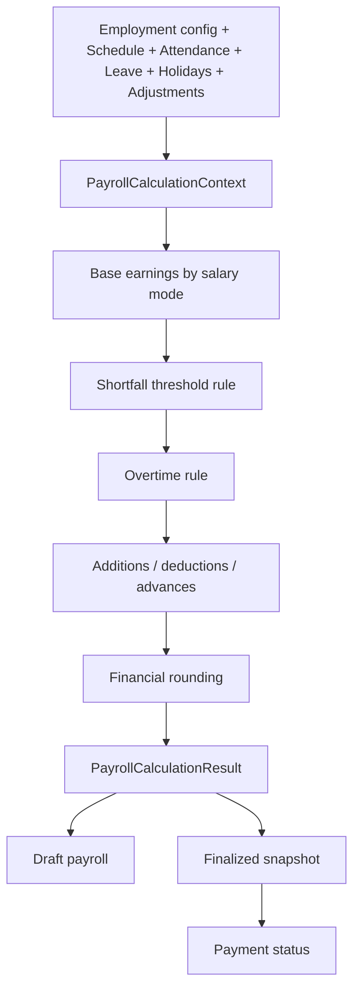
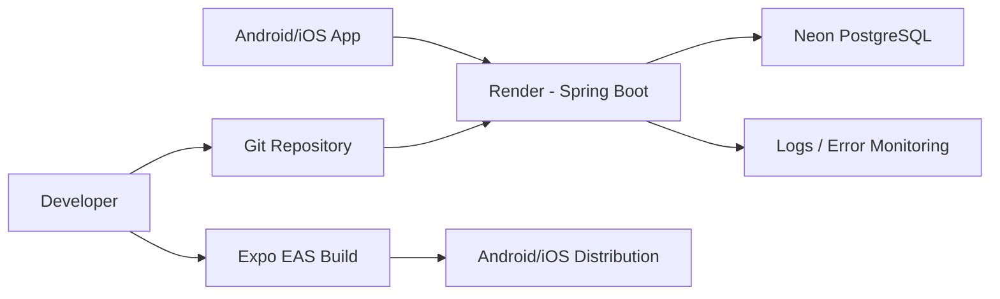

# 03 — Architecture Document

## 1. Recommended architecture

Use a modular monolith for the Spring Boot backend and one React Native/Expo application.



## 2. Why modular monolith

The product has one core business domain and likely household-scale traffic. A modular monolith keeps deployment, transactions and local development simple while preserving clear domain boundaries.

Do not start with microservices.

## 3. Backend module boundaries

```text
com.example.maidmanager
  auth/
  owner/
  maid/
  employment/
  attendance/
  leave/
  holiday/
  payroll/
  report/
  audit/
  common/
```

Controllers should coordinate HTTP concerns only. Domain/service classes own business rules. Repositories own persistence access.

## 4. Salary engine architecture

Create an interface similar to:

```text
SalaryCalculator
  + calculate(PayrollCalculationContext) : PayrollCalculationResult
```

Implement strategies:

```text
MonthlySalaryCalculator
DailySalaryCalculator
HourlySalaryCalculator
```

Shared rule services handle:
- calendar/schedule determination
- join/leave proration
- shortfall threshold evaluation
- overtime
- leave and holiday treatment
- adjustments
- rounding

The selected salary mode determines the base earnings calculation. Shared attendance/pay adjustment logic remains reusable.

## 5. Mobile architecture

Recommended layers:

```text
app/screens
components
features/auth
features/dashboard
features/maids
features/attendance
features/payroll
features/reports
features/settings
services/api
services/auth
state
utils
```

Prefer a feature-oriented structure. Keep API access in a centralized client with consistent auth/error handling.

## 6. Authentication architecture

Recommended:
- Short-lived JWT access token.
- Long-lived rotating refresh token stored server-side in hashed/revocable form.
- On mobile, store tokens in Expo SecureStore rather than AsyncStorage.
- Logout revokes the refresh token/session.

The access token should identify the authenticated owner. The backend derives the owner ID from the authenticated principal.

## 7. Authorization

Never accept ownerId from client requests for ownership decisions.

For resource access:

```text
Authenticated principal
  -> owner identity
  -> load maid with owner constraint
  -> operate on maid
```

A request for maidId belonging to another owner must produce a safe not-found/forbidden response according to the API security policy without leaking resource existence.

## 8. Attendance architecture

Attendance write operations use a transaction and an idempotency mechanism. The business date is calculated using the owner's configured timezone or the worker's employment timezone if a per-worker override is introduced later.

Multiple sessions per business day are supported.

## 9. Payroll architecture



## 10. Data flow

Dashboard request:

```text
Mobile -> GET /api/v1/dashboard?date=...
      -> authenticated owner
      -> aggregate active maid status
      -> return compact dashboard DTO
```

Entry request:

```text
Mobile -> POST /api/v1/maids/{id}/attendance/sessions/entry
      -> authorize maid belongs to owner
      -> resolve business date/time
      -> open session transactionally
      -> return updated attendance state
```

## 11. Deployment architecture



## 12. Future extension points

- Maid accounts.
- Push notifications.
- Offline-first attendance queue.
- Recurring/automatic holiday sets.
- Multiple shifts per day with richer shift policies.
- Advanced payroll reports.
- Cloud object storage for report archives.
