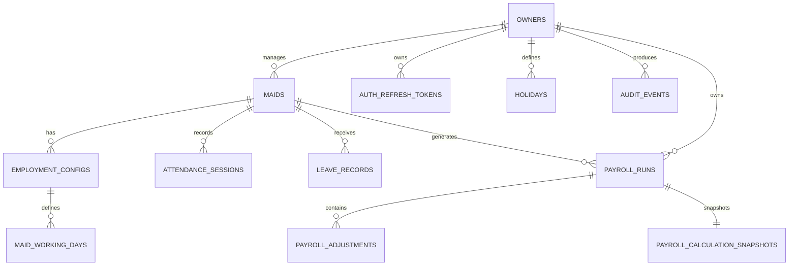

# 04 — Database Design

## 1. Core tables

### owners
- id UUID PK
- name VARCHAR(120) NOT NULL
- phone VARCHAR(30)
- email VARCHAR(255) UNIQUE NULL
- timezone VARCHAR(64) NOT NULL DEFAULT 'Asia/Kolkata'
- currency_code CHAR(3) NOT NULL DEFAULT 'INR'
- created_at TIMESTAMPTZ NOT NULL
- updated_at TIMESTAMPTZ NOT NULL

### auth_refresh_tokens
- id UUID PK
- owner_id UUID FK owners(id)
- token_hash VARCHAR(255) UNIQUE NOT NULL
- expires_at TIMESTAMPTZ NOT NULL
- revoked_at TIMESTAMPTZ NULL
- created_at TIMESTAMPTZ NOT NULL

### maids
- id UUID PK
- owner_id UUID FK owners(id)
- name VARCHAR(120) NOT NULL
- phone VARCHAR(30) NULL
- joining_date DATE NOT NULL
- leaving_date DATE NULL
- notes TEXT NULL
- is_active BOOLEAN NOT NULL DEFAULT true
- created_at TIMESTAMPTZ NOT NULL
- updated_at TIMESTAMPTZ NOT NULL

Index: (owner_id, is_active), (owner_id, name)

### employment_configs
Versioned employment/salary settings.
- id UUID PK
- maid_id UUID FK maids(id)
- effective_from DATE NOT NULL
- effective_to DATE NULL
- salary_mode VARCHAR(20) NOT NULL CHECK IN (MONTHLY, DAILY, HOURLY)
- salary_amount NUMERIC(12,2) NOT NULL
- expected_minutes_per_day INTEGER NOT NULL
- shortfall_threshold_minutes INTEGER NOT NULL
- overtime_enabled BOOLEAN NOT NULL DEFAULT false
- overtime_multiplier NUMERIC(6,3) NOT NULL DEFAULT 1.0
- created_at TIMESTAMPTZ NOT NULL
- updated_at TIMESTAMPTZ NOT NULL

Constraint: no overlapping effective ranges for the same maid.

### maid_working_days
- id UUID PK
- employment_config_id UUID FK employment_configs(id)
- weekday SMALLINT NOT NULL 1..7
- UNIQUE(employment_config_id, weekday)

This keeps working-day selection explicit rather than reducing it to a count.

### attendance_sessions
- id UUID PK
- maid_id UUID FK maids(id)
- business_date DATE NOT NULL
- entry_at TIMESTAMPTZ NULL
- exit_at TIMESTAMPTZ NULL
- status VARCHAR(20) NOT NULL
- note TEXT NULL
- created_by UUID FK owners(id)
- updated_by UUID FK owners(id)
- created_at TIMESTAMPTZ NOT NULL
- updated_at TIMESTAMPTZ NOT NULL

Index: (maid_id, business_date)
Constraint: exit_at >= entry_at when both exist.

Do not add a unique constraint on (maid_id, business_date) because multiple sessions/day are supported.

### leave_records
- id UUID PK
- maid_id UUID FK maids(id)
- leave_date DATE NOT NULL
- leave_type VARCHAR(10) CHECK IN (PAID, UNPAID)
- note TEXT NULL
- created_at TIMESTAMPTZ NOT NULL
- updated_at TIMESTAMPTZ NOT NULL
- UNIQUE(maid_id, leave_date)

### holidays
- id UUID PK
- owner_id UUID FK owners(id)
- holiday_date DATE NOT NULL
- name VARCHAR(120) NOT NULL
- created_at TIMESTAMPTZ NOT NULL
- updated_at TIMESTAMPTZ NOT NULL
- UNIQUE(owner_id, holiday_date)

### payroll_runs
Represents one maid's payroll for one month.
- id UUID PK
- owner_id UUID FK owners(id)
- maid_id UUID FK maids(id)
- payroll_month DATE NOT NULL (normalize to first day of month)
- status VARCHAR(20) NOT NULL CHECK IN (DRAFT, FINALIZED, PAID)
- finalized_at TIMESTAMPTZ NULL
- paid_at TIMESTAMPTZ NULL
- payment_method VARCHAR(30) NULL
- payment_note TEXT NULL
- created_at TIMESTAMPTZ NOT NULL
- updated_at TIMESTAMPTZ NOT NULL
- UNIQUE(maid_id, payroll_month)

### payroll_adjustments
- id UUID PK
- payroll_run_id UUID FK payroll_runs(id)
- type VARCHAR(20) CHECK IN (ADVANCE, BONUS, DEDUCTION, OTHER_ADD, OTHER_DEDUCTION)
- amount NUMERIC(12,2) NOT NULL
- adjustment_date DATE NOT NULL
- reason VARCHAR(255) NULL
- created_at TIMESTAMPTZ NOT NULL

### payroll_calculation_snapshots
- id UUID PK
- payroll_run_id UUID FK payroll_runs(id) UNIQUE
- input_snapshot JSONB NOT NULL
- result_snapshot JSONB NOT NULL
- engine_version VARCHAR(30) NOT NULL
- created_at TIMESTAMPTZ NOT NULL

Snapshot JSON is intentional here: it preserves a reproducible financial calculation while normalized source tables remain the system of record.

### audit_events
- id UUID PK
- owner_id UUID FK owners(id)
- actor_owner_id UUID FK owners(id)
- entity_type VARCHAR(40) NOT NULL
- entity_id UUID NOT NULL
- action VARCHAR(40) NOT NULL
- before_data JSONB NULL
- after_data JSONB NULL
- created_at TIMESTAMPTZ NOT NULL

For high-value events, audit data must not contain passwords/tokens.

## 2. ER diagram



## 3. Tenant isolation strategy

Every owner-owned table carries owner_id directly where useful. Child resources additionally verify ownership through their parent relationship.

For example, attendance lookup must never be:

```sql
SELECT * FROM attendance_sessions WHERE id = :id;
```

Instead enforce ownership through a joined parent or repository method that accepts the authenticated owner context.

## 4. Money and time

- Money: NUMERIC(12,2) in PostgreSQL; BigDecimal in Java.
- Durations: integer minutes.
- Event timestamps: TIMESTAMPTZ.
- Business date: DATE.
- Owner timezone: IANA timezone name.

## 5. Migration strategy

Use Flyway.

Never modify an already-applied migration. Add a new migration for every schema change.

Recommended sequence:

- V1 owners/auth
- V2 maids/employment
- V3 attendance/leave/holidays
- V4 payroll/adjustments/snapshots
- V5 audit/index hardening

## 6. Retention

MVP should retain historical attendance and finalized payroll rather than deleting dependent data when a maid is archived.
