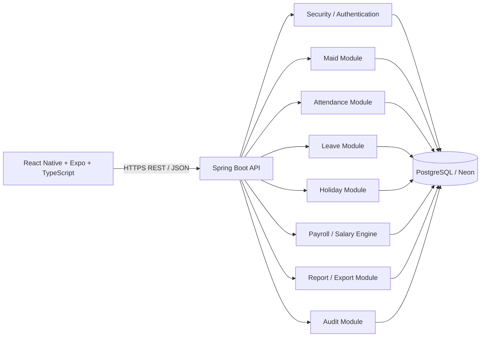
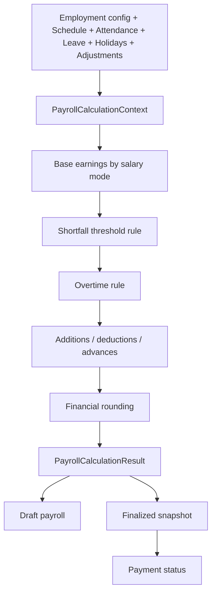
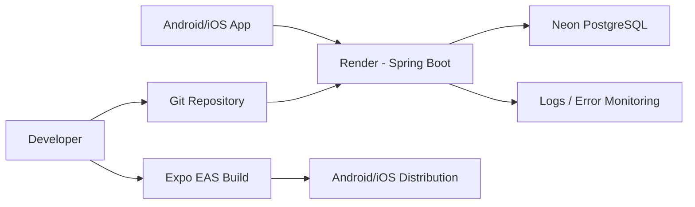
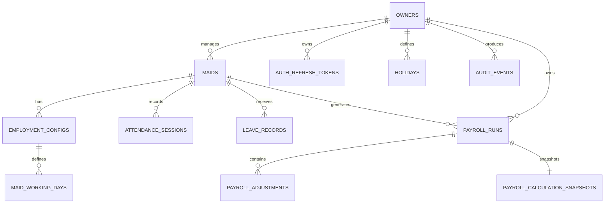

# FILE: 00-README.md

# Maid & Worker Salary Manager — Documentation Blueprint

## Purpose

This documentation set is the implementation blueprint for a production-ready mobile application that lets an owner/employer manage domestic maids/workers, record attendance, and calculate salary.

## Core product model

Owner → many maids/workers → employment configuration + attendance + leave + holidays + payroll.

The owner is the primary application user. Maids do not need an application account in MVP.

## Finalized decisions

1. Each maid can use a salary calculation mode chosen by the owner:
   - Monthly
   - Daily
   - Hourly
2. Short working time is deducted only when shortage crosses a configurable threshold. The product should support a threshold such as 7h 30m for an 8-hour schedule.
3. Overtime is configurable per maid: ON/OFF plus multiplier. Default: OFF.
4. Working weekdays are decided by the owner for each maid.
5. Leave supports Paid and Unpaid types.
6. Holidays are manually managed by the owner for MVP.
7. Mid-month join/leave proration uses expected working days.
8. Attendance stores a local business date plus entry/exit timestamps.
9. Multiple attendance sessions per business day are supported.
10. The owner can edit attendance at any time. Manual edits create audit records.
11. Monthly salary reports can be exported as CSV and PDF.
12. Monthly payroll supports Draft → Finalized → Paid lifecycle.
13. Advances and additions/deductions are supported as payroll adjustments.
14. Salary/employment settings are versioned with effective dates so historical calculations remain correct.

## Documentation set

- 01-PRD.md — Product Requirements Document
- 02-SRS.md — Software Requirements Specification
- 03-ARCHITECTURE.md — System and module architecture
- 04-DATABASE.md — PostgreSQL database design and Mermaid ERD
- 05-API-SPEC.md — Versioned REST API
- 06-SALARY-RULES.md — Deterministic payroll rules
- 07-UI-UX.md — Mobile UX, navigation, screens and states
- 08-TEST-PLAN.md — Test strategy and cases
- 09-DEPLOYMENT.md — Local and production deployment
- 10-DEVELOPMENT-PLAN.md — Incremental implementation roadmap
- 11-AI-CODING-GUIDELINES.md — Rules for an AI coding agent

## MVP principles

- Fastest possible daily attendance workflow.
- Simple owner-centric UX.
- Strict owner data isolation.
- Financial calculations are deterministic, auditable and reproducible.
- No hidden business rules.
- No premature microservices or complex infrastructure.
- Keep future extensibility at domain boundaries.


# FILE: 01-PRD.md

# 01 — Product Requirements Document

## 1. Product vision

A simple mobile-first household workforce manager that helps an owner record daily attendance and reliably calculate, review, finalize and track monthly pay for domestic maids/workers.

## 2. Problem

Owners often track attendance and salary mentally, in notebooks, chats or spreadsheets. This makes mistakes likely when workers have different salaries, schedules, absences, leave, overtime, partial workdays or salary changes.

## 3. Goals

- Record entry/exit in seconds.
- Manage multiple maids under one owner account.
- Support monthly, daily and hourly salary modes per maid.
- Apply configurable attendance, leave, holiday and overtime rules consistently.
- Make salary calculations explainable.
- Preserve historical payroll results.
- Prevent cross-owner data access.
- Provide monthly reports and PDF/CSV export.

## 4. Non-goals for MVP

- Maid-facing app/account.
- Government payroll, tax, PF/ESI or statutory payroll processing.
- Automatic India holiday calendars.
- GPS, geofencing, biometrics or facial recognition.
- Complex shift planning.
- Chat/messaging.
- Multi-level organization/employee permissions.
- Full accounting integration.

## 5. Primary persona

### Household owner/employer

Needs a fast, low-friction way to record attendance and know exactly what to pay each worker.

## 6. Key user journeys

### Add worker
Login → Add Maid → enter profile → configure working weekdays/hours → choose salary mode → save.

### Start work
Dashboard → tap Entry for worker → backend creates a session for today's business date.

### End work
Dashboard → tap Exit → backend closes the active session.

### Correct mistake
Maid → Attendance → select date/session → Edit → save. System writes audit event.

### Month-end payroll
Reports → select month → review per-maid calculation → review adjustments → finalize → optionally mark paid → export PDF/CSV.

## 7. MVP features

### Authentication
- Register
- Login
- Logout
- Access/refresh token strategy
- Password hashing
- Password reset flow

### Owner profile
- View/edit basic profile
- Timezone configuration
- Currency configuration, default INR for India deployment

### Maid management
- Add/edit/view
- Archive/deactivate
- Search/filter
- Active/inactive status
- Joining/leaving date
- Notes

### Employment configuration
- Salary mode: Monthly/Daily/Hourly
- Salary amount
- Expected hours/day
- Working weekdays
- Shortfall threshold
- Overtime enabled + multiplier
- Effective date

### Attendance
- Multiple sessions/day
- Entry
- Exit
- Edit
- Delete
- Absent
- Paid leave
- Unpaid leave
- Holiday/weekly off interpretation
- Incomplete attendance state
- Attendance notes

### Holiday management
- Create/edit/delete manual holidays
- Holiday date
- Name
- Optional paid/unpaid classification if the salary policy needs it

### Payroll
- Calculate selected month
- Detailed line items
- Shortfall deduction
- Overtime
- Advances
- Other additions/deductions
- Proration for join/leave
- Draft/finalized/paid lifecycle
- Historical snapshot

### Reports
- Owner monthly summary
- Per-maid details
- PDF export
- CSV export

### Audit
- Manual attendance edits
- Payroll finalization
- Payroll payment changes
- Important configuration changes

## 8. Success metrics

- Median time to record an attendance event: < 5 seconds after opening the relevant action.
- Monthly payroll recalculation matches expected test matrix 100%.
- No authorized cross-owner data access in security tests.
- Crash-free critical attendance flow target suitable for production monitoring.
- Low correction rate for newly entered attendance.

## 9. Acceptance criteria

The product is MVP-complete when an owner can:

1. Create an account and log in securely.
2. Add multiple workers with independent configurations.
3. Record multiple attendance sessions on the same business date.
4. Correct attendance and see audit history.
5. Configure monthly, daily or hourly salary mode per maid.
6. Calculate pay using explicit documented rules.
7. Add paid/unpaid leave, holidays and adjustments.
8. Review a monthly payroll result before finalization.
9. Finalize and later mark payroll paid.
10. Export the monthly report as CSV and PDF.
11. Never access another owner's worker or payroll data.


# FILE: 02-SRS.md

# 02 — Software Requirements Specification

## 1. Functional requirements

### FR-001 Authentication
The system shall allow owner registration, login and logout. Passwords shall be stored only as secure password hashes.

### FR-002 Tenant isolation
Every owner-owned resource shall be associated with an owner/tenant identifier. Every read/write operation shall enforce owner authorization at the service boundary.

### FR-003 Maid management
The system shall support CRUD-like management with archive/deactivate rather than destructive removal where historical payroll depends on the record.

### FR-004 Employment configuration
A maid shall have versioned salary/work schedule configuration with effective dates.

### FR-005 Attendance
A maid may have zero or more attendance sessions for a business date. Each session has optional entry and exit timestamps.

### FR-006 Attendance state
Derived states include NOT_STARTED, WORKING, COMPLETED, INCOMPLETE, ABSENT, LEAVE and HOLIDAY/WEEKLY_OFF as applicable.

### FR-007 Leave
Leave record shall support PAID and UNPAID types.

### FR-008 Holidays
Owner-managed holidays shall be stored independently of attendance and evaluated during payroll calculation.

### FR-009 Payroll
The system shall calculate payroll deterministically from the effective employment configuration, schedule, calendar, attendance, leave, holidays and adjustments.

### FR-010 Payroll snapshot
Finalization shall persist a snapshot of the calculation inputs/results needed to reproduce the payroll result.

### FR-011 Payments
Payroll can be marked paid with payment date, method and optional note.

### FR-012 Export
Selected-month payroll can be exported to CSV and PDF.

## 2. Non-functional requirements

### Performance
- Dashboard API should be optimized for one owner and its active maids.
- Attendance entry/exit endpoint should be lightweight and idempotent.
- Monthly payroll calculation should be fast enough for a normal household scale without background jobs in MVP.

### Reliability
- No silent loss of attendance on API failure.
- Retries must not create duplicate sessions or duplicate exits.
- Database transactions must protect state transitions.

### Security
- TLS in production.
- Password hashing using a modern adaptive algorithm.
- Short-lived access token and rotating/revocable refresh tokens.
- Authorization checks on every owner-owned resource.
- No sensitive data in logs.
- Validate and sanitize user input.
- Never trust client-provided owner IDs.

### Financial integrity
- Java BigDecimal for money.
- Integer minutes for durations.
- Explicit rounding mode documented in salary rules.
- Finalized payroll must be immutable except through an explicit correction/reopening workflow.

## 3. Core validation rules

- Worker name is required.
- Salary must be positive unless a special zero-paid configuration is intentionally supported; MVP recommendation: > 0.
- Expected working hours/day must be greater than zero for salary modes that depend on hours.
- Working weekdays must contain at least one day.
- Overtime multiplier must be >= 1.0 when overtime is enabled.
- Shortfall threshold must be between 0 and expected minutes/day.
- Exit timestamp cannot precede its entry timestamp for the same session unless an explicit overnight shift policy is enabled.
- An exit cannot be recorded when no open session exists.
- Duplicate client requests must not create duplicate state transitions.
- Joining date cannot be after leaving date.
- Leave and manual attendance states must follow the documented conflict matrix.

## 4. State and conflict principles

Attendance data is source data. Payroll is a derived financial result. Editing attendance does not mutate a finalized payroll snapshot automatically.

When a draft payroll is recalculated, current valid source data is used.

When finalized, the snapshot is authoritative until explicitly corrected/reopened.

## 5. Auditing

At minimum audit:
- Attendance create/update/delete by owner.
- Maid employment configuration changes.
- Payroll adjustments.
- Payroll finalization/reopening.
- Payment status changes.


# FILE: 03-ARCHITECTURE.md

# 03 — Architecture Document

## 1. Recommended architecture

Use a modular monolith for the Spring Boot backend and one React Native/Expo application.



## 2. Why modular monolith

The product has one core business domain and likely household-scale traffic. A modular monolith keeps deployment, transactions and local development simple while preserving clear domain boundaries.

Do not start with microservices.

## 3. Backend module boundaries

```text
com.example.maidmanager
  auth/
  owner/
  maid/
  employment/
  attendance/
  leave/
  holiday/
  payroll/
  report/
  audit/
  common/
```

Controllers should coordinate HTTP concerns only. Domain/service classes own business rules. Repositories own persistence access.

## 4. Salary engine architecture

Create an interface similar to:

```text
SalaryCalculator
  + calculate(PayrollCalculationContext) : PayrollCalculationResult
```

Implement strategies:

```text
MonthlySalaryCalculator
DailySalaryCalculator
HourlySalaryCalculator
```

Shared rule services handle:
- calendar/schedule determination
- join/leave proration
- shortfall threshold evaluation
- overtime
- leave and holiday treatment
- adjustments
- rounding

The selected salary mode determines the base earnings calculation. Shared attendance/pay adjustment logic remains reusable.

## 5. Mobile architecture

Recommended layers:

```text
app/screens
components
features/auth
features/dashboard
features/maids
features/attendance
features/payroll
features/reports
features/settings
services/api
services/auth
state
utils
```

Prefer a feature-oriented structure. Keep API access in a centralized client with consistent auth/error handling.

## 6. Authentication architecture

Recommended:
- Short-lived JWT access token.
- Long-lived rotating refresh token stored server-side in hashed/revocable form.
- On mobile, store tokens in Expo SecureStore rather than AsyncStorage.
- Logout revokes the refresh token/session.

The access token should identify the authenticated owner. The backend derives the owner ID from the authenticated principal.

## 7. Authorization

Never accept ownerId from client requests for ownership decisions.

For resource access:

```text
Authenticated principal
  -> owner identity
  -> load maid with owner constraint
  -> operate on maid
```

A request for maidId belonging to another owner must produce a safe not-found/forbidden response according to the API security policy without leaking resource existence.

## 8. Attendance architecture

Attendance write operations use a transaction and an idempotency mechanism. The business date is calculated using the owner's configured timezone or the worker's employment timezone if a per-worker override is introduced later.

Multiple sessions per business day are supported.

## 9. Payroll architecture



## 10. Data flow

Dashboard request:

```text
Mobile -> GET /api/v1/dashboard?date=...
      -> authenticated owner
      -> aggregate active maid status
      -> return compact dashboard DTO
```

Entry request:

```text
Mobile -> POST /api/v1/maids/{id}/attendance/sessions/entry
      -> authorize maid belongs to owner
      -> resolve business date/time
      -> open session transactionally
      -> return updated attendance state
```

## 11. Deployment architecture



## 12. Future extension points

- Maid accounts.
- Push notifications.
- Offline-first attendance queue.
- Recurring/automatic holiday sets.
- Multiple shifts per day with richer shift policies.
- Advanced payroll reports.
- Cloud object storage for report archives.


# FILE: 04-DATABASE.md

# 04 — Database Design

## 1. Core tables

### owners
- id UUID PK
- name VARCHAR(120) NOT NULL
- phone VARCHAR(30)
- email VARCHAR(255) UNIQUE NULL
- timezone VARCHAR(64) NOT NULL DEFAULT 'Asia/Kolkata'
- currency_code CHAR(3) NOT NULL DEFAULT 'INR'
- created_at TIMESTAMPTZ NOT NULL
- updated_at TIMESTAMPTZ NOT NULL

### auth_refresh_tokens
- id UUID PK
- owner_id UUID FK owners(id)
- token_hash VARCHAR(255) UNIQUE NOT NULL
- expires_at TIMESTAMPTZ NOT NULL
- revoked_at TIMESTAMPTZ NULL
- created_at TIMESTAMPTZ NOT NULL

### maids
- id UUID PK
- owner_id UUID FK owners(id)
- name VARCHAR(120) NOT NULL
- phone VARCHAR(30) NULL
- joining_date DATE NOT NULL
- leaving_date DATE NULL
- notes TEXT NULL
- is_active BOOLEAN NOT NULL DEFAULT true
- created_at TIMESTAMPTZ NOT NULL
- updated_at TIMESTAMPTZ NOT NULL

Index: (owner_id, is_active), (owner_id, name)

### employment_configs
Versioned employment/salary settings.
- id UUID PK
- maid_id UUID FK maids(id)
- effective_from DATE NOT NULL
- effective_to DATE NULL
- salary_mode VARCHAR(20) NOT NULL CHECK IN (MONTHLY, DAILY, HOURLY)
- salary_amount NUMERIC(12,2) NOT NULL
- expected_minutes_per_day INTEGER NOT NULL
- shortfall_threshold_minutes INTEGER NOT NULL
- overtime_enabled BOOLEAN NOT NULL DEFAULT false
- overtime_multiplier NUMERIC(6,3) NOT NULL DEFAULT 1.0
- created_at TIMESTAMPTZ NOT NULL
- updated_at TIMESTAMPTZ NOT NULL

Constraint: no overlapping effective ranges for the same maid.

### maid_working_days
- id UUID PK
- employment_config_id UUID FK employment_configs(id)
- weekday SMALLINT NOT NULL 1..7
- UNIQUE(employment_config_id, weekday)

This keeps working-day selection explicit rather than reducing it to a count.

### attendance_sessions
- id UUID PK
- maid_id UUID FK maids(id)
- business_date DATE NOT NULL
- entry_at TIMESTAMPTZ NULL
- exit_at TIMESTAMPTZ NULL
- status VARCHAR(20) NOT NULL
- note TEXT NULL
- created_by UUID FK owners(id)
- updated_by UUID FK owners(id)
- created_at TIMESTAMPTZ NOT NULL
- updated_at TIMESTAMPTZ NOT NULL

Index: (maid_id, business_date)
Constraint: exit_at >= entry_at when both exist.

Do not add a unique constraint on (maid_id, business_date) because multiple sessions/day are supported.

### leave_records
- id UUID PK
- maid_id UUID FK maids(id)
- leave_date DATE NOT NULL
- leave_type VARCHAR(10) CHECK IN (PAID, UNPAID)
- note TEXT NULL
- created_at TIMESTAMPTZ NOT NULL
- updated_at TIMESTAMPTZ NOT NULL
- UNIQUE(maid_id, leave_date)

### holidays
- id UUID PK
- owner_id UUID FK owners(id)
- holiday_date DATE NOT NULL
- name VARCHAR(120) NOT NULL
- created_at TIMESTAMPTZ NOT NULL
- updated_at TIMESTAMPTZ NOT NULL
- UNIQUE(owner_id, holiday_date)

### payroll_runs
Represents one maid's payroll for one month.
- id UUID PK
- owner_id UUID FK owners(id)
- maid_id UUID FK maids(id)
- payroll_month DATE NOT NULL (normalize to first day of month)
- status VARCHAR(20) NOT NULL CHECK IN (DRAFT, FINALIZED, PAID)
- finalized_at TIMESTAMPTZ NULL
- paid_at TIMESTAMPTZ NULL
- payment_method VARCHAR(30) NULL
- payment_note TEXT NULL
- created_at TIMESTAMPTZ NOT NULL
- updated_at TIMESTAMPTZ NOT NULL
- UNIQUE(maid_id, payroll_month)

### payroll_adjustments
- id UUID PK
- payroll_run_id UUID FK payroll_runs(id)
- type VARCHAR(20) CHECK IN (ADVANCE, BONUS, DEDUCTION, OTHER_ADD, OTHER_DEDUCTION)
- amount NUMERIC(12,2) NOT NULL
- adjustment_date DATE NOT NULL
- reason VARCHAR(255) NULL
- created_at TIMESTAMPTZ NOT NULL

### payroll_calculation_snapshots
- id UUID PK
- payroll_run_id UUID FK payroll_runs(id) UNIQUE
- input_snapshot JSONB NOT NULL
- result_snapshot JSONB NOT NULL
- engine_version VARCHAR(30) NOT NULL
- created_at TIMESTAMPTZ NOT NULL

Snapshot JSON is intentional here: it preserves a reproducible financial calculation while normalized source tables remain the system of record.

### audit_events
- id UUID PK
- owner_id UUID FK owners(id)
- actor_owner_id UUID FK owners(id)
- entity_type VARCHAR(40) NOT NULL
- entity_id UUID NOT NULL
- action VARCHAR(40) NOT NULL
- before_data JSONB NULL
- after_data JSONB NULL
- created_at TIMESTAMPTZ NOT NULL

For high-value events, audit data must not contain passwords/tokens.

## 2. ER diagram



## 3. Tenant isolation strategy

Every owner-owned table carries owner_id directly where useful. Child resources additionally verify ownership through their parent relationship.

For example, attendance lookup must never be:

```sql
SELECT * FROM attendance_sessions WHERE id = :id;
```

Instead enforce ownership through a joined parent or repository method that accepts the authenticated owner context.

## 4. Money and time

- Money: NUMERIC(12,2) in PostgreSQL; BigDecimal in Java.
- Durations: integer minutes.
- Event timestamps: TIMESTAMPTZ.
- Business date: DATE.
- Owner timezone: IANA timezone name.

## 5. Migration strategy

Use Flyway.

Never modify an already-applied migration. Add a new migration for every schema change.

Recommended sequence:

- V1 owners/auth
- V2 maids/employment
- V3 attendance/leave/holidays
- V4 payroll/adjustments/snapshots
- V5 audit/index hardening

## 6. Retention

MVP should retain historical attendance and finalized payroll rather than deleting dependent data when a maid is archived.


# FILE: 05-API-SPEC.md

# 05 — REST API Specification

Base URL:

```text
/api/v1
```

JSON content type. HTTPS in production.

## 1. Standard error shape

```json
{
  "code": "VALIDATION_ERROR",
  "message": "One or more fields are invalid.",
  "fieldErrors": {
    "salaryAmount": "Must be greater than 0"
  },
  "requestId": "uuid"
}
```

Never return stack traces to the mobile client.

## 2. Authentication

### POST /auth/register
Auth: public

Request:
```json
{"name":"Ash","email":"owner@example.com","password":"..."}
```

Response 201: owner profile + token/session response.

### POST /auth/login
Auth: public

Request: credentials.

Response 200: access token + refresh token/session metadata.

### POST /auth/refresh
Auth: refresh token/session.

### POST /auth/logout
Auth: authenticated.

## 3. Owner

### GET /me
Returns authenticated owner profile.

### PATCH /me
Updates profile/timezone/currency.

## 4. Maids

### GET /maids
Query:
- active=true|false
- search
- page
- size

### POST /maids
Request fields:
- name
- phone
- joiningDate
- notes
- initial employment configuration

### GET /maids/{maidId}
Returns maid + active employment config + schedule.

### PATCH /maids/{maidId}
Updates profile fields.

### POST /maids/{maidId}/archive
Archives/deactivates worker.

### POST /maids/{maidId}/employment-configs
Creates a new effective-dated configuration.

### GET /maids/{maidId}/employment-configs
Returns configuration history.

## 5. Attendance

### GET /maids/{maidId}/attendance
Query:
- from
- to

### POST /maids/{maidId}/attendance/sessions/entry
Creates a new open session for the resolved business date.

Optional request:
```json
{"businessDate":"2026-09-09","clientRequestId":"uuid"}
```

The backend validates the date against timezone and ownership policy. Client should not be able to create a session for arbitrary owners.

### POST /maids/{maidId}/attendance/sessions/{sessionId}/exit
Closes an open session.

### PATCH /maids/{maidId}/attendance/sessions/{sessionId}
Owner-only manual edit.

### DELETE /maids/{maidId}/attendance/sessions/{sessionId}
Owner-only. Should require confirmation in UI and may be blocked once linked to a finalized payroll unless a reopening policy is used.

### POST /maids/{maidId}/attendance/manual-status
Request:
```json
{"businessDate":"2026-09-09","status":"ABSENT","note":"Sick"}
```

Conflict rules must prevent contradictory states with existing open sessions.

## 6. Leave

### GET /maids/{maidId}/leave
Query from/to.

### POST /maids/{maidId}/leave
Request:
```json
{"leaveDate":"2026-09-11","type":"PAID","note":"Personal"}
```

### PATCH /maids/{maidId}/leave/{leaveId}

### DELETE /maids/{maidId}/leave/{leaveId}

## 7. Holidays

### GET /holidays
Query month/year.

### POST /holidays
Request:
```json
{"holidayDate":"2026-10-02","name":"Gandhi Jayanti"}
```

### PATCH /holidays/{holidayId}
### DELETE /holidays/{holidayId}

## 8. Dashboard

### GET /dashboard
Query: date optional.

Response example:
```json
{
  "date":"2026-09-09",
  "activeMaidCount":5,
  "entries":[
    {"maidId":"uuid","maidName":"Rani","state":"WORKING","entryAt":"2026-09-09T03:30:00Z"}
  ],
  "currentMonth": {
    "salaryPayable": 58000.00,
    "currency":"INR"
  }
}
```

## 9. Payroll

### POST /payroll/runs/calculate
Request:
```json
{"maidId":"uuid","month":"2026-09"}
```

Returns calculation without changing finalized source data.

### GET /payroll/runs
Query month, status.

### GET /payroll/runs/{payrollRunId}
Returns detailed breakdown.

### POST /payroll/runs/{payrollRunId}/adjustments
Adds advance/bonus/deduction/addition.

### POST /payroll/runs/{payrollRunId}/finalize
Persists snapshot and changes DRAFT to FINALIZED.

### POST /payroll/runs/{payrollRunId}/mark-paid
Request:
```json
{"paidAt":"2026-10-01","paymentMethod":"UPI","paymentNote":"Paid"}
```

## 10. Reports

### GET /reports/monthly
Query month.
Returns owner summary + per-maid breakdown.

### GET /reports/monthly.csv
Streams CSV.

### GET /reports/monthly.pdf
Generates PDF.

## 11. Common status codes

- 200 OK
- 201 Created
- 204 No Content
- 400 Validation/business request error
- 401 Unauthenticated
- 403 Authenticated but not allowed
- 404 Resource not accessible/found
- 409 State conflict or uniqueness conflict
- 422 Optional semantic validation if the backend standard chooses it
- 429 Rate limited
- 500 Unexpected server error

## 12. Idempotency

Attendance entry/exit and payment-changing requests should accept a client request ID or Idempotency-Key. The backend stores a bounded request result or uses a transaction-safe unique key to make repeated submissions harmless.


# FILE: 06-SALARY-RULES.md

# 06 — Salary Rules and Calculation Engine

## 1. Business vocabulary

- Expected working day: a date that is in the maid's configured working weekdays and is not excluded by joining/leaving bounds.
- Expected minutes: expected hours/day × 60.
- Actual worked minutes: sum of completed attendance session durations for the business date.
- Shortfall: expected minutes − actual minutes when actual is lower.
- Overtime: actual minutes above expected minutes, subject to overtime rules.
- Paid leave: excluded from absence/shortfall deductions and counts toward expected pay treatment.
- Unpaid leave: excluded from worked time and may reduce earnings according to salary mode.

## 2. Salary modes

### Monthly
Base monthly salary is the configured amount for a full eligible month. Join/leave proration uses expected working days.

For a partial month:

```text
Prorated base = Monthly salary × Eligible expected working days / Full-month expected working days
```

Shortfall and overtime are then applied according to the worker's configuration.

### Daily
Daily base rate is the configured daily salary amount. Pay is based on eligible expected working days and leave/pay policy.

Recommended MVP interpretation:
- worked expected day => daily amount
- paid leave => daily amount
- unpaid leave => 0
- weekly off/holiday => no deduction
- shortfall deduction applies if the configured threshold is crossed.

### Hourly
Base rate is the configured hourly amount. Actual payable minutes are determined by the attendance/leave/threshold policy.

## 3. Working calendar

Expected working dates are derived from:

1. Month boundaries.
2. Joining date.
3. Leaving date if present.
4. Owner-selected working weekdays.
5. Manual holidays.
6. Leave records.

A weekly off or holiday is not treated as an absence merely because no attendance exists.

## 4. Shortfall threshold

The owner configures a threshold per employment configuration.

For an 8-hour expected day with threshold 7h30m:

- Actual >= 7h30m → no shortfall deduction for that day.
- Actual < 7h30m → shortage is chargeable/deductible according to the selected salary mode.

This means the threshold acts as a grace floor, not as a partial-credit threshold.

Recommended calculation:

```text
Chargeable shortfall = expected minutes - actual minutes
```

when actual is below the threshold.

The engine must expose both raw shortfall and whether the threshold was crossed.

## 5. Overtime

Per maid:
- enabled: boolean
- multiplier: decimal >= 1.0

Default: disabled.

For an expected 8h day and 10h actual:

```text
Overtime = 120 minutes
Overtime pay = overtime hours × base hourly equivalent × multiplier
```

For monthly/daily modes, calculate an effective hourly equivalent using the configured salary and full-month expected working time relevant to the payroll period.

For hourly mode, use the configured hourly rate.

## 6. Leave

### Paid leave
The expected-day entitlement remains paid. Leave hours are not counted as worked hours for overtime.

### Unpaid leave
No base pay is earned for that day under the daily/monthly proration portion. It does not become a shortfall merely because there is no attendance.

## 7. Public holidays

Manual owner-defined holidays are excluded from expected working days for payroll by default.

The owner can manage the holiday list. Automatic government holiday synchronization is not part of MVP.

## 8. Weekly off

Owner chooses working weekdays. Non-working weekdays are expected-off days and do not generate absence deductions.

## 9. Joining/leaving mid-month

Proration uses expected working days.

Example:

```text
Full-month expected working days = 26
Eligible expected days after joining/leaving bounds = 18
Monthly salary = ₹15,000
Prorated base = 15,000 × 18 / 26
```

For a daily salary configuration, the eligible expected-day count determines base earnings directly.

## 10. Salary/configuration changes during month

Configuration is effective-dated. The payroll engine splits the month into configuration periods and calculates each period independently.

Example:

```text
1–14 Sep: ₹15,000/month config
15–30 Sep: ₹18,000/month config
```

Each period uses its own expected minutes, weekdays and threshold.

## 11. Multiple sessions per day

Actual worked minutes are the sum of completed sessions.

Example:

```text
09:00–13:00 = 240 min
16:00–18:00 = 120 min
Total = 360 min = 6h
```

Overnight sessions are supported at the timestamp level; the business-date assignment must follow the configured attendance policy. MVP should allow overnight sessions only if the owner explicitly enables an overnight setting. Otherwise reject a session crossing midnight.

## 12. Missing/incomplete attendance

- Entry without exit → INCOMPLETE and excluded from finalized salary calculation unless manually corrected/closed.
- Exit without open entry → reject.
- Duplicate entry for an open session → reject.
- Duplicate entry after completing one session → allowed as a new session only through explicit user action.
- Exit before entry → reject.

For draft payroll, an incomplete session should be surfaced as a blocking warning or unresolved exception rather than silently assuming zero or full hours.

## 13. Attendance vs leave/holiday conflicts

Recommended precedence:

1. Explicit manual correction.
2. Attendance sessions.
3. Leave.
4. Holiday/weekly-off classification.
5. Ordinary expected workday.

If attendance exists on a leave day, the payroll engine should flag a conflict. MVP policy: attendance wins for worked-time calculation; leave remains visible as a conflict requiring owner review.

## 14. Adjustments

A payroll run can include:
- ADVANCE — subtraction from final payable.
- BONUS — addition.
- DEDUCTION — subtraction.
- OTHER_ADD — addition.
- OTHER_DEDUCTION — subtraction.

Each adjustment requires amount, date and optional reason.

## 15. Rounding

Durations: integer minutes; do not round each session prematurely.

Money: calculate using BigDecimal. Recommended final currency rounding to 2 decimal places with HALF_UP. Keep full precision internally until final currency rounding.

## 16. Illustrative calculation

For monthly mode:

```text
Base prorated earnings
- shortfall deductions
+ overtime pay
+ bonuses/additions
- advances
- deductions
= final payable
```

The detailed result should expose every component instead of only returning one total.

## 17. Result contract

```json
{
  "month":"2026-09",
  "salaryMode":"MONTHLY",
  "monthlySalary":15000.00,
  "expectedWorkingDays":24,
  "eligibleWorkingDays":24,
  "expectedMinutes":11520,
  "actualWorkedMinutes":11400,
  "shortfallMinutes":120,
  "thresholdCrossedDays":1,
  "overtimeMinutes":0,
  "baseEarnings":15000.00,
  "shortfallDeduction":144.23,
  "overtimePay":0.00,
  "additions":500.00,
  "deductions":1000.00,
  "finalPayable":14355.77,
  "currency":"INR"
}
```

The numbers are illustrative only.

## 18. Payroll lifecycle

```text
DRAFT -> FINALIZED -> PAID
```

A finalized run stores a snapshot. Editing source records does not silently mutate the final amount.

A correction workflow may later be implemented:

```text
PAID -> REOPENED/CORRECTION -> DRAFT -> FINALIZED -> PAID
```

That is a controlled administrative action, not an automatic side effect.


# FILE: 07-UI-UX.md

# 07 — UI/UX Specification

## 1. UX principle

The app is primarily a daily attendance tool. The fastest path should be visible immediately after login.

## 2. Navigation

Recommended bottom navigation:

```text
Home | Maids | Payroll | Settings
```

Attendance is primarily accessed through Home and Maid Details rather than becoming a separate top-level tab.

## 3. Screen list

### Authentication
- Splash
- Login
- Register
- Forgot password

### Home
- Dashboard
- Today status
- Quick Entry/Exit
- Monthly salary snapshot

### Maids
- Maid list
- Add maid
- Maid details
- Edit maid
- Employment/salary settings
- Attendance history
- Leave history

### Payroll
- Payroll month selector
- Payroll summary
- Maid payroll detail
- Adjustments
- Finalize confirmation
- Payment confirmation
- Export

### Settings
- Owner profile
- Timezone/currency
- Holiday management
- Account/logout

## 4. Dashboard wireframe-level behavior

```text
--------------------------------
Today, 9 Sep

5 Active Maids

Rani       Working  09:05   [Exit]
Sita       Not started       [Entry]
Pooja      Complete 09:00-17:00
Maya       Incomplete        [Review]
Rekha      On Leave

--------------------------------
September
Salary payable: ₹58,000
[View Payroll]
--------------------------------
```

The actual design should use accessible typography, large touch targets and clear status labels.

## 5. Entry/Exit interaction

Entry:
1. Owner taps Entry.
2. App shows immediate loading state.
3. On success, worker changes to Working.
4. Record timestamp from backend authoritative time.

Exit:
1. Owner taps Exit.
2. App confirms only where accidental taps are plausible; avoid unnecessary dialogs if the control is clearly distinct.
3. On success, worker changes to Completed.

Do not rely solely on the mobile clock for authoritative payroll timestamps.

## 6. Maid detail

Sections:
- Profile
- Today
- Attendance calendar/list
- Employment & Salary
- Leave
- Payroll summary

## 7. Employment form

Fields:
- Joining date
- Leaving date (optional)
- Salary mode selector
- Salary amount
- Expected hours/day
- Working weekdays
- Shortfall threshold
- Overtime enabled
- Overtime multiplier
- Effective from

Show contextual examples based on selected salary mode.

## 8. Attendance history

Date rows should show:
- Status
- Sessions
- Worked duration
- Warning/conflict indicator
- Edit action

Multiple sessions should be visually grouped under one date.

## 9. Payroll detail

Use a transparent breakdown:

```text
Base earnings                         ₹15,000
Shortfall deduction                    -₹144
Overtime                              +₹0
Paid leave                             included
Advance                              -₹1,000
Bonus                                 +₹500
-------------------------------------------
Final payable                        ₹14,356
```

Also expose expected vs actual minutes and a day-by-day exception list.

## 10. Payroll finalization

Finalization modal:
- Month
- Maid
- Current amount
- Unresolved attendance warnings
- Adjustments summary
- Explicit "Finalize payroll" action

After finalization, show that the result is locked and provide a controlled correction path if implemented.

## 11. Payment screen

- Status: Unpaid/Paid
- Payment date
- Payment method: Cash / UPI / Bank / Other
- Note

## 12. Loading/error/empty states

Every API-driven screen needs:
- Skeleton/loading state where appropriate.
- Retry action for network failures.
- Empty state when no maids/payroll records exist.
- Inline field validation.
- Non-destructive toast/banner for successful edits.

Never show a blank screen after a failed API request.

## 13. Offline/network handling

MVP can remain online-first. The mobile app should cache recent read data but must not pretend an attendance write succeeded while offline.

When offline during an attendance action:
- Show clear offline state.
- Do not silently queue unless an explicit offline queue is implemented.
- Offer retry.

Architecture should leave room for a later durable offline command queue.

## 14. Accessibility

- Large touch targets.
- Do not encode status by color alone.
- Good contrast.
- Screen-reader labels for Entry/Exit buttons.
- Clear date/time formats.
- Avoid dense tables on phone width.


# FILE: 08-TEST-PLAN.md

# 08 — Test Plan

## 1. Test strategy

The most valuable test coverage is the salary engine and the tenant/security boundary.

Layers:
- Unit tests
- Service tests
- Repository/integration tests
- Controller/API tests
- Security/authorization tests
- Mobile component/flow tests
- End-to-end critical path tests where practical

## 2. Salary test matrix

| Case | Expected result |
|---|---|
| Full monthly attendance | Full configured base salary subject to other rules |
| One normal short day above threshold | No shortfall deduction |
| Short day below threshold | Deduction applied |
| Exact threshold | No shortfall deduction |
| Zero attendance on expected day | Absence/unpaid treatment according to mode |
| Paid leave | Paid day; no overtime from leave |
| Unpaid leave | No base pay for that day |
| Weekly off | No absence deduction |
| Manual holiday | Excluded from expected workdays |
| Overtime OFF | No overtime pay |
| Overtime ON | Overtime pay using multiplier |
| Monthly mode | Monthly calculation correct |
| Daily mode | Daily calculation correct |
| Hourly mode | Hour-based calculation correct |
| Join mid-month | Expected-working-day proration |
| Leave mid-month | Correct eligible-day treatment |
| Leaving mid-month | Correct proration |
| Salary config changes mid-month | Split-period calculation |
| Multiple sessions | Sum minutes correctly |
| Incomplete session | Blocking warning / unresolved exception |
| Duplicate submission | Idempotent; no duplicate state |
| Decimal salary | Exact BigDecimal result and final 2-decimal rounding |
| Advance | Correct subtraction |
| Bonus | Correct addition |
| Finalization | Snapshot preserved |
| Source edit after finalization | Final snapshot unchanged until controlled correction |

## 3. Attendance edge cases

- Exit before entry rejected.
- Exit without open entry rejected.
- Duplicate exit rejected.
- Multiple sessions allowed only when the user intentionally creates a new session.
- Same timestamp entry/exit is either rejected or treated as 0 minutes; MVP recommendation: allow but flag zero duration for correction rather than silently creating paid time.
- Very long duration should be validated against a configurable maximum sanity threshold for ordinary shifts.
- Overnight sessions rejected unless enabled by explicit policy.
- Network retry does not duplicate session.

## 4. Security tests

### Critical
- User A cannot GET User B maid.
- User A cannot PATCH User B attendance.
- User A cannot calculate User B payroll by ID.
- User A cannot export User B report.
- Crafted IDs cannot bypass repository/service authorization.
- Refresh token for another account is rejected.
- Archived maid cannot be mutated through stale client state without explicit policy.

## 5. API tests

Validate:
- HTTP status code.
- Response contract.
- Validation failures.
- Error codes.
- Authentication behavior.
- Authorization behavior.
- Idempotency behavior.

## 6. Mobile tests

Critical flows:
- Register/login.
- Add maid.
- Entry.
- Exit.
- Multiple sessions.
- Edit attendance.
- Leave creation.
- Monthly payroll review.
- Finalize.
- Mark paid.
- Export.
- Network failure retry.

## 7. Definition of test completeness

No payroll rule should be considered complete until its normal path, boundary values and at least one conflict/error case are tested.


# FILE: 09-DEPLOYMENT.md

# 09 — Deployment Guide

## 1. Development prerequisites

- JDK compatible with the selected Spring Boot release.
- Node.js compatible with the selected Expo SDK.
- npm/pnpm/yarn according to repository convention.
- PostgreSQL local instance or development database.
- Expo CLI/EAS CLI.
- Git.

Exact versions should be pinned by the implementation phase rather than loosely relying on latest packages.

## 2. Repository layout

```text
/
  mobile/
  backend/
  docs/
  scripts/
  README.md
```

## 3. Backend configuration

Environment variables should include values similar to:

```text
SPRING_PROFILES_ACTIVE
DATABASE_URL
DATABASE_USERNAME
DATABASE_PASSWORD
JWT_ACCESS_SECRET
JWT_REFRESH_SECRET
JWT_ACCESS_TTL
JWT_REFRESH_TTL
CORS_ALLOWED_ORIGINS
APP_DEFAULT_TIMEZONE
APP_DEFAULT_CURRENCY
```

Do not commit secrets.

## 4. Local database

Run PostgreSQL locally and configure backend connection. Flyway must run automatically on application startup in controlled environments.

## 5. Neon

Create a production PostgreSQL database in Neon.

Recommended separation:
- development
- staging, if used
- production

Use separate credentials and environment variables.

## 6. Render

Deploy the Spring Boot backend as a web service.

Build steps should:
1. checkout repository
2. build backend
3. run tests
4. start Spring Boot application

Set production environment variables in Render's secret environment configuration.

Health endpoint:

```text
/actuator/health
```

Expose only the minimum actuator endpoints publicly.

## 7. Database migrations

Migrations must execute in a controlled deployment sequence. Before destructive or large migrations, make sure a backup/recovery path exists.

Never edit an already applied migration.

## 8. Mobile environment configuration

Use environment-specific API base URLs:

```text
EXPO_PUBLIC_API_URL
```

Production mobile builds must point at production HTTPS API.

## 9. Expo/EAS

Use EAS Build for Android/iOS production artifacts.

Configure:
- bundle/package identifiers
- app icon/splash
- production environment variables
- signing credentials
- version/build numbers

## 10. Observability

Minimum production observability:
- structured application logs
- request correlation/request ID
- error monitoring
- database connection/error monitoring
- Render health checks

Never log:
- passwords
- access tokens
- refresh tokens
- full authentication headers

## 11. Backups and recovery

Use provider-supported PostgreSQL backup/recovery capabilities and test recovery at least periodically.

A backup is only useful if restoration has been validated.

## 12. Production release checklist

- Tests green.
- Flyway migrations reviewed.
- Environment variables configured.
- HTTPS verified.
- Authentication tested.
- Cross-owner authorization tests green.
- Salary matrix green.
- EAS production build points to production API.
- Database backup/recovery available.
- Error monitoring active.


# FILE: 10-DEVELOPMENT-PLAN.md

# 10 — Development Plan

## Phase 0 — Requirements lock

Objective: eliminate business ambiguity.

Tasks:
- Freeze salary modes/rules.
- Freeze leave/holiday semantics.
- Freeze attendance state model.
- Freeze payroll lifecycle.
- Review all docs together.

Definition of done:
- No unresolved business rule exists in the implementation contract.

## Phase 1 — Repository foundation

Tasks:
- Create monorepo folders.
- Spring Boot project.
- Expo TypeScript project.
- Shared docs conventions.
- Environment templates.
- CI baseline.

Tests:
- Backend starts.
- Mobile app starts.

## Phase 2 — Database and persistence

Tasks:
- Flyway migrations.
- Entities and repositories.
- Base auditing timestamps.
- Constraints/indexes.

Tests:
- Migration integration test.
- Constraint tests.

## Phase 3 — Authentication/security

Tasks:
- Registration/login/logout/refresh.
- Password hashing.
- Secure token storage mobile-side.
- Owner authorization.

Definition of done:
- Cross-owner access tests fail safely.

## Phase 4 — Maid and employment management

Tasks:
- Maid CRUD/archive.
- Employment configuration.
- Working weekday selection.
- Effective-dated history.

## Phase 5 — Attendance

Tasks:
- Entry/exit.
- Multiple sessions.
- Manual edit/delete.
- Attendance statuses.
- Idempotency.
- Audit events.

Definition of done:
- Common daily workflow works with one to several workers.

## Phase 6 — Leave and holidays

Tasks:
- Paid/unpaid leave.
- Manual holidays.
- Conflict validation.

## Phase 7 — Salary engine

Tasks:
- Calculation context.
- Monthly strategy.
- Daily strategy.
- Hourly strategy.
- Threshold rule.
- Overtime rule.
- Proration.
- Adjustments.
- Rounding.
- Snapshot.

Definition of done:
- Full salary test matrix passes.

## Phase 8 — Payroll UI and reports

Tasks:
- Month selection.
- Detail breakdown.
- Review/finalize.
- Payment status.
- CSV/PDF export.

## Phase 9 — Mobile integration and UX hardening

Tasks:
- Dashboard quick actions.
- Error/loading/empty states.
- Navigation.
- Accessibility basics.
- Network retry behavior.

## Phase 10 — Security/performance/reliability

Tasks:
- Pen-test-style authorization checks.
- Input validation review.
- Query/index review.
- Idempotency review.
- Logging review.
- Crash/error monitoring.

## Phase 11 — Release

Tasks:
- Neon production DB.
- Render production backend.
- EAS production build.
- Smoke tests.
- Backup/recovery confirmation.
- Documentation finalization.

## Recommended AI-agent execution format

Each phase should be implemented as small PR-sized tasks:

```text
Task → inspect existing code → implement → tests → run tests → summarize changed files → stop
```

An AI coding agent should not silently jump to another phase.


# FILE: 11-AI-CODING-GUIDELINES.md

# 11 — AI Coding Guidelines

## 1. General rule

Do not generate the entire application in one pass. Implement the documented roadmap phase-by-phase.

Before changing code:
- inspect repository structure
- inspect existing module boundaries
- read relevant tests
- identify affected migrations/API contracts

## 2. Architecture rules

- Keep backend as a modular monolith.
- Controllers handle transport concerns.
- Services/use-cases handle business logic.
- Salary calculation lives in payroll/domain services, not controllers.
- Repository queries enforce ownership constraints.
- DTOs separate API models from persistence entities where appropriate.

## 3. Database rules

- Flyway only for migrations.
- Never rewrite an applied migration.
- Add indexes based on access patterns.
- Preserve historical payroll data.
- Do not use floating-point types for money.

## 4. Security rules

- Never trust client ownerId.
- Derive authenticated owner from security context.
- Check parent ownership before child resource access.
- Hash passwords securely.
- Do not log credentials/tokens.
- Validate every external input.
- Keep secrets out of source control.

## 5. API contract rules

- Preserve /api/v1 contracts after implementation unless a documented version change is approved.
- Use stable response/error shapes.
- Use pagination where list size can grow.
- Return clear business conflict errors.

## 6. Attendance implementation rules

- Backend owns authoritative timestamps.
- Business date is timezone-aware.
- Entry/exit transitions are transactional.
- Repeated network submissions must be idempotent.
- Multiple sessions/day are intentional.
- Manual edits produce audit records.

## 7. Salary engine rules

- Implement pure/deterministic calculation where possible.
- Inputs must be explicit in a calculation context.
- Do not query random application state from inside the core calculation logic.
- Use BigDecimal.
- Keep duration arithmetic in integer minutes.
- Write tests before modifying complicated payroll rules.
- Do not silently invent new salary behavior.

## 8. UI rules

- Optimize the dashboard for one-tap attendance.
- Use large touch targets.
- Avoid unnecessary navigation.
- Every network mutation needs loading/success/failure state.
- Never show an optimistic attendance success unless the backend confirms success, unless a durable offline queue is later introduced.

## 9. Ambiguity handling

When requirements are ambiguous:

1. Check the documentation first.
2. Check existing tests/accepted decisions.
3. Prefer the smallest behavior consistent with the documented product.
4. If ambiguity materially changes financial/security behavior, stop implementation and record an explicit decision request.
5. Never silently change a business rule because it seems convenient.

## 10. Avoid breaking functionality

Before a change:
- identify impacted endpoints/screens/tests
- make a focused change
- run relevant tests
- run regression tests

Do not perform unrelated refactors during feature work.

## 11. Dependency rules

Before adding a library:
- verify the project does not already solve the problem
- prefer stable, well-supported dependencies
- minimize dependencies
- document the reason for significant additions

## 12. Testing rules

Every new business rule gets tests.

Every security-sensitive endpoint gets authorization tests.

Every migration gets an integration path.

Payroll changes must include regression tests against the salary matrix.

## 13. Documentation rules

When behavior changes:
- update API docs
- update salary rules if financial behavior changed
- update schema docs for DB changes
- update tests
- update changelog/release notes as appropriate

## 14. Agent output format

After each implementation task, return:

```text
Implemented:
- ...

Files changed:
- ...

Tests:
- ...

Known limitations:
- ...

Next task:
- ...
```

## 15. Definition of done

A feature is not done merely because it compiles.

It is done when:
- implementation matches the docs
- validation exists
- error states exist
- authorization is covered
- tests pass
- relevant documentation is updated
- no unrelated behavior was broken
